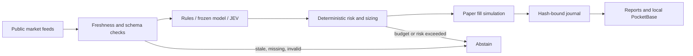

<div align="center">

# EdgeHunter

### Auditable prediction-market research that keeps the losses, provenance, and uncertainty

[](https://github.com/AnthonySmith96/edgehunter/actions/workflows/ci.yml)
[](https://www.python.org/)
[](LICENSE)
[](#what-edgehunter-is)

**Public market data · deterministic risk · durable journals · honest scorecards**

</div>

EdgeHunter is an open research engine for prediction markets. It reads public Polymarket and Coinbase data, evaluates rule-based, learned, and JEV forecasts, simulates fills with costs and depth, and saves enough evidence to audit each decision.

It cannot sign orders, hold wallets, transfer funds, or trade real money. Its balances are `SIM_USD`. The current evidence does **not** show a repeatable profitable edge.

## The scorecard, including the losses

These are frozen snapshots from September 18, 2026. A report file does not mean its process is still running.

| Experiment | Evidence | Result | Honest reading |
|---|---:|---:|---|
| JEV prospective paper run | 33 resolved forecasts, 20 settled fills | 12W / 8L, **−35.6451 SIM_USD** | JEV Brier 0.1695; market 0.1305. The market baseline calibrated better. |
| Frozen learned BTC v5 | prospective report snapshot | 0 fills | No prospective performance claim is possible. |
| Historical experiment 1 | frozen backtest | −5.3641 base | Losing result. |
| Historical experiment 2 | frozen backtest | +1.7987 base; −6.4038 conservative | Sensitive to execution assumptions. |
| External replication | frozen backtest | −9.7154 base | Did not replicate a profit. |
| End-to-end demo | synthetic fixtures | +1.2072 SIM_USD | Proves the circuit, not a market opportunity. |

Read the paired calibration audit in [reports/jev_review_20260918.md](reports/jev_review_20260918.md) and the full implementation status in [IMPLEMENTATION_STATUS.md](IMPLEMENTATION_STATUS.md).

## Fork, add your key, run

The supported one-click path is Windows 10/11 with Python 3.11–3.13 and internet access.

1. Click **Fork** on GitHub, then clone your fork.
2. Double-click **`CONFIGURAR_EDGEHUNTER.bat`**. It creates an ignored `.env` and opens it in Notepad.
3. Paste your `TYPESAFE_API_KEY`. Leave `TYPESAFE_BUDGET_USD=0` for a no-spend setup, or set a positive cap only when you intentionally authorize API cost.
4. Double-click **`INICIAR_EDGEHUNTER.bat`** for the core paper daemon, or **`INICIAR_BTC_JEV.bat`** for the JEV experiment.

The core daemon and public-data research do not require a TypeSafe key. JEV inference requires both a key and a positive budget. Configuration, journals, databases, logs, and provider credentials stay in ignored local paths.

PowerShell equivalent:

```powershell
git clone https://github.com/YOUR-USER/edgehunter.git
cd edgehunter
.\scripts\configure.ps1
.\scripts\bootstrap.ps1
.\.venv\Scripts\python.exe -m edgehunter status
```

Run the self-contained synthetic demo with:

```powershell
.\scripts\bootstrap.ps1 -Demo
```

Stop the daemon with `DETENER_EDGEHUNTER.bat`. JEV and the BTC experiments have separate start/stop launchers and separate paper accounts.

## What EdgeHunter is



- **Causal inputs:** observations carry timestamps, source URLs, and integrity metadata.
- **Conservative failure:** stale books, missing candles, unknown order state, exhausted budgets, and invalid clocks block new simulated risk.
- **Durable accounting:** reservations survive restarts; a timeout is not silently converted into a fill or loss.
- **Frozen experiments:** changing policy or implementation invalidates the registered manifest instead of rewriting an old result.
- **Provider containment:** TypeSafe has a timeout, durable usage reserve, explicit cap, and zero-spend default.

## Reproduce and inspect

```powershell
.\.venv\Scripts\python.exe scripts\check_public_release.py
.\.venv\Scripts\python.exe -m pytest -q
.\.venv\Scripts\python.exe -m mypy src
.\.venv\Scripts\ruff.exe check src tests scripts deploy
.\.venv\Scripts\python.exe scripts\audit_btc_jev.py
```

Versioned reports let reviewers inspect the claims. Large raw research datasets and runtime journals are intentionally excluded from Git; code-only forks therefore cannot replay every offline historical command byte-for-byte until they collect or supply the corresponding public data. Download and capture scripts are included, and provider redistribution terms still apply.

Key evidence:

| Area | Evidence |
|---|---|
| JEV run and paired scoring | [JEV experiment guide](docs/JEV_EXPERIMENT.md) · [machine-readable audit](reports/jev_review_20260918.json) |
| Historical and prospective results | [Acceptance report](ACCEPTANCE_REPORT.md) · [270-day BTC summary](reports/btc_history_270d_summary.md) |
| Accounting and operational controls | [Accounting](docs/ACCOUNTING.md) · [Operations](docs/OPERATIONS.md) |
| Data providers and verified limits | [Providers](docs/PROVIDERS.md) |
| Human authority boundaries | [Human actions](HUMAN_ACTIONS.md) |

## Current limits

The execution model uses simulated fees, slippage, latency, and visible depth; those assumptions do not prove fills available to a real account. Coinbase is a proxy for resolution reference data. `jev-latest` may move unless the provider returns a specific version. The Linux deployment files are templates and have not been validated on a production host. There is no continuous WebSocket user channel, live wallet integration, or real-money execution path.

EdgeHunter is research software, not investment advice. Treat every positive result as a hypothesis until it survives fresh data, realistic costs, and an untouched prospective period.

## Contribute

The project needs better calibration tests, execution realism, provider adapters, cross-platform onboarding, dataset manifests, and report visualization. See [CONTRIBUTING.md](CONTRIBUTING.md). Security reports belong in GitHub's private vulnerability flow described in [.github/SECURITY.md](.github/SECURITY.md).

Licensed under [Apache 2.0](LICENSE).
