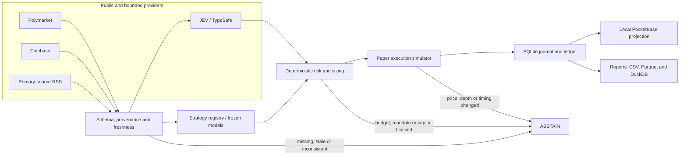

<div align="center">

# EdgeHunter

### From public market data to an auditable paper decision

[](https://github.com/AnthonySmith96/edgehunter/actions/workflows/ci.yml)
[](https://www.python.org/)
[](LICENSE)
[](#execution-modes)

**Research engine · JEV commander · causal simulation · deterministic risk · durable accounting · local control plane**

</div>

EdgeHunter is an open research and paper-execution stack for prediction markets. It connects public observations, strategy logic, probabilistic forecasts, risk limits, simulated order-book execution, official settlement, and reproducible reports in one system.

It is built to answer more than _“did a backtest make money?”_:

- What information was available when the decision was made?
- Was the book fresh, deep enough, and still attractive after inference latency?
- Was capital really available, or already reserved by another idea?
- Can the decision, abstention, fill, settlement, and model version be audited later?
- Does a forecast beat the market baseline on the same resolved cohort?

EdgeHunter cannot sign orders, hold wallets, transfer funds, or trade real money. Every balance is `SIM_USD`, and the current evidence does **not** demonstrate a repeatable profitable edge.

## What ships today

| Capability | Status | What is included |
|---|---|---|
| **Public market ingestion** | ✅ Verified | Real Polymarket catalog, contracts, books, fees, market time, geoblock and history reads; Coinbase BTC data and Federal Reserve RSS probes |
| **Causal paper execution** | ✅ Tested | Top-of-book depth, consumed liquidity, latency, adverse movement, fees, cancellation, expiry and official simulated settlement |
| **Risk and accounting core** | ✅ Tested | Exact `Decimal` arithmetic, cash reservations, exposure limits, idempotency, TTLs, unknown-state handling and balanced SQLite ledger entries |
| **JEV commander** | ✅ Real inference tested | Structured BTC dossiers, UP/DOWN probabilities, returned model version, fractional Kelly sizing, API budget, timeout, durable usage reserve and post-inference price/depth checks |
| **Frozen learned BTC runner** | ✅ Operational paper path | Registered model hash, source hash, current public books, contiguous Coinbase candles, one attempt per market and a separate 100 `SIM_USD` account |
| **Seven strategy families** | 🧪 Logic and abstention tested | Structural, market making, wallet intelligence, weather, news/cross-market, forecasting and radar plugins; currently data-blocked for autonomous operation |
| **Research laboratory** | ✅ Executed | Causal historical evaluation, temporal splits, frozen holdouts, resumable atomic checkpoints, sharded downloads, calibration, external replication and capital stress tests |
| **PocketBase control plane** | ✅ Tested locally | Dedicated verified binary, migrations, roles, server hooks, immutable decision fields, authenticated pause/stop controls and audit projection |
| **Operations and recovery** | ✅ Tested locally | Single-instance lock, daemon heartbeats, task progress, conservative degradation, restart persistence, checksum backups and isolated restore verification |
| **Parquet + DuckDB evidence store** | ✅ Tested | Hashes, manifests, resource limits, local quota and queryable research snapshots |
| **Notifications** | 🧪 Local path tested | Durable outbox, retry/unknown handling and local mail sink; Brevo adapter is mock-tested but external delivery is not certified |
| **Linux deployment** | 🚧 Templates only | Rendered systemd and Nginx templates; no production VPS, VPN, MFA or external monitor has been deployed |

`✅` means exercised with real public data or a real local service. `🧪` means the logic is implemented and tested but its external data or provider path is not operationally certified. `🚧` marks preparation that still needs deployment evidence.

## Five ways to use it

| Workflow | Launcher | Purpose |
|---|---|---|
| Core research daemon | `INICIAR_EDGEHUNTER.bat` | Observe public markets, evaluate registered strategy logic, enforce risk and expose local operational state |
| BTC paper baseline | `INICIAR_BTC_PAPER.bat` | Run the earlier BTC five-minute prospective paper experiment in its own account |
| Frozen learned BTC | `INICIAR_BTC_APRENDIDO.bat` | Evaluate the registered learned model without silently retraining or reopening its holdout |
| JEV BTC commander | `INICIAR_BTC_JEV.bat` | Let JEV produce the forecast while deterministic code keeps budget, sizing, execution and accounting authority |
| End-to-end demo | `.\scripts\bootstrap.ps1 -Demo` | Exercise opportunities, rejections, approvals, fills, settlement, PocketBase and local notification delivery with labeled synthetic data |

Each long-running workflow has a matching `DETENER_*.bat`. The BTC runners keep separate journals and balances, so their PnL must not be combined.

## Fork, add your key, run

The supported one-click path is Windows 10/11 with Python 3.11–3.13 and internet access.

1. Click **Fork** on GitHub and clone your fork.
2. Double-click **`CONFIGURAR_EDGEHUNTER.bat`**. It creates an ignored `.env` and opens it in Notepad.
3. Paste `TYPESAFE_API_KEY` if you want JEV. Keep `TYPESAFE_BUDGET_USD=0` for a no-spend setup, or set a positive cap only when you intentionally authorize API cost.
4. Open the launcher for the workflow you want.

The core daemon, historical tooling, and public-data paper runners do not require a TypeSafe key. JEV inference requires both a key and a positive budget. The bootstrap never enables real trading.

PowerShell equivalent:

```powershell
git clone https://github.com/YOUR-USER/edgehunter.git
cd edgehunter
.\scripts\configure.ps1
.\scripts\bootstrap.ps1
.\.venv\Scripts\python.exe -m edgehunter status
```

The bootstrap creates an isolated environment, installs the locked dependencies, downloads the pinned PocketBase build, verifies its SHA-256, applies migrations, runs the environment doctor, and starts the daemon in the background. It does not overwrite an existing `.env` or PocketBase identity.

## Architecture



The model can propose a probability; it cannot grant itself capital, bypass a stale input, force a minimum stake, or turn a failed request into a fill.

## The execution and risk engine

EdgeHunter models the parts that optimistic backtests often skip:

- Uses executable asks and available depth instead of treating midpoint as a guaranteed fill.
- Re-fetches market data after JEV latency and rejects an entry if price, edge, depth, clock, or time-to-close changed.
- Reserves cash before a simulated order and keeps the reservation across restarts.
- Treats a timeout or ambiguous provider response as `UNKNOWN`; it does not retry blindly or invent a loss/fill.
- Rejects a trade when the venue minimum exceeds the risk-approved size instead of rounding risk upward.
- Separates deposits, free cash, reserved cash, inventory cost, fees, trading PnL and operating costs.
- Uses business idempotency keys and database transactions to survive duplicate events and crashes.
- Halts or abstains when the ledger, lease, clock, evidence, or provider state is unsafe.

The effective configuration is always the most restrictive intersection of host policy, strategy state, available evidence, budget and human control.

## JEV is the forecaster, not the treasurer

The JEV path gives the model a compact state dossier and asks for a structured BTC probability. Code retains authority over everything that can spend or fabricate evidence:

1. Validate market identity, timestamps, books, candles and ticker.
2. Reserve a bounded API amount before inference.
3. Record the returned model/version, probability and token usage.
4. Compute fractional Kelly sizing under hard cash and per-bet caps.
5. Abstain when Kelly size is below the venue minimum.
6. Fetch fresh books and BTC inputs again after inference.
7. Simulate a fill only if the priced edge and visible depth still survive.
8. Score every resolved forecast, including abstentions, against the market baseline.

The usage ledger persists in `data/btc_jev/usage.db`, so restarting does not reset an authorized API budget. The public template defaults that budget to zero.

## Seven strategy families, with explicit blockers

| Family | Implemented reasoning | Why it still abstains today |
|---|---|---|
| Structural | Scenario payoff coverage, multi-leg costs, adverse selection and unwind loss | Needs a verified contract matrix and executable atomic/unwind route |
| Market making | Tick-aware quotes, inventory skew, cooldown, post-only support, fill and markout inputs | Needs a validated queue/fill/markout model and reconciled inventory |
| Wallet intelligence | Buys, sells, fees and redemptions separated from deposits and withdrawals | Needs complete point-in-time cashflows and a prospectively selected cohort |
| Weather | Station, unit, period, ensemble members and contract mapping | Needs archived issued forecasts and temporal calibration |
| News / cross-market | Primary entity/source, publication time, first observation and recycled-news rejection | Needs a calibrated effect for the exact target |
| Forecasting | Probability interval, fees, book freshness and temporal training order | Needs a validated forecast/calibrator for the matching contract |
| Radar | Seasonality-aware activity, catalyst, price and exit liquidity | Needs legitimate, continuously observed inputs for each watched asset class |

Every family returns a typed `PROPOSE` or `ABSTAIN`. A proposal still passes through the core risk engine; no plugin can authorize itself or promote itself to live execution.

## Research without moving the goalposts

The repository includes more than runtime code:

- **183,691 causal BTC observations** evaluated across 270 days.
- **81 manual rules** and **96 learned variants** recorded with their losing and inconclusive results.
- Time-ordered train/validation/holdout partitions with frozen experiment identities.
- Atomic checkpoints with dataset, configuration and implementation fingerprints.
- Resume support that refuses an incompatible or already-completed holdout directory.
- Sharded history downloads and a measured 0.125-second split of the 183,691-row dataset.
- Capital stress diagnostics covering pending funds, sizing and modeled costs.
- Paired Brier score and log-loss evaluation on the exact same resolved cohort.
- External-tail replication instead of selecting only the most favorable sample.

Changing a frozen policy, source report or implementation hash invalidates the manifest. The system requires a new experiment identity rather than rewriting the old outcome.

## Local operations and control plane

PocketBase is a local administration projection, while the SQLite journal and ledger remain the financial authority. The local stack includes:

- Role-separated daemon and human identities.
- Server-side transition hooks for protected decisions.
- Authenticated pause/stop requests and durable audit records.
- Loopback-only administrator URL with credentials stored under restricted `.local/` state.
- Heartbeat age, task progress, source errors, abstention reasons and ledger validity in `status`.
- Consistent backup, checksum inspection and isolated restore tests.
- A durable notification outbox and local mail sink for demos.

Useful commands:

```powershell
.\.venv\Scripts\python.exe -m edgehunter status
.\.venv\Scripts\python.exe -m edgehunter doctor --redact
.\.venv\Scripts\python.exe -m edgehunter sources probe
.\.venv\Scripts\python.exe -m edgehunter strategies evaluate
.\.venv\Scripts\python.exe -m edgehunter approvals list
.\.venv\Scripts\python.exe -m edgehunter reconcile --read-only
.\.venv\Scripts\python.exe -m edgehunter report --period all
```

## Execution modes

| Mode | Behavior |
|---|---|
| `DEMO` | Isolated synthetic fixtures, simulated approval, local PocketBase and local notification sink |
| `REPLAY` | Historical evidence only; no current-market action |
| `SHADOW` | Reads current public data and records decisions without fills |
| `PAPER` | Allows simulated fills under the frozen candidate and risk gates |
| `LIVE` | Not implemented and not enabled |

There is no wallet signer, private trading SDK, withdrawal path, on-chain redemption flow, or real-money capability hidden behind a flag.

## Honest scorecard

These are frozen snapshots from September 18, 2026. A report file does not mean its process is still running.

| Experiment | Evidence | Result | Reading |
|---|---:|---:|---|
| JEV prospective paper run | 33 resolved forecasts, 20 settled fills | 12W / 8L, **−35.6451 SIM_USD** | JEV Brier 0.1695; market 0.1305. The market baseline calibrated better. |
| Frozen learned BTC v5 | prospective report snapshot | 0 fills | No prospective performance claim is possible. |
| Earlier BTC paper | 8 settled fills | 4W / 4L, **−5.3535 SIM_USD** | The first win did not persist. |
| Historical experiment 1 | frozen backtest | −5.3641 base | Losing result. |
| Historical experiment 2 | frozen backtest | +1.7987 base; −6.4038 conservative | Sensitive to execution assumptions. |
| External replication | frozen backtest | −9.7154 base | Did not replicate a profit. |
| End-to-end demo | synthetic fixtures | +1.2072 SIM_USD | Proves the circuit, not a market opportunity. |

See the paired [JEV audit](reports/jev_review_20260918.md), [270-day BTC summary](reports/btc_history_270d_summary.md), and [complete implementation status](IMPLEMENTATION_STATUS.md).

## Repository map

```text
src/edgehunter/domain/         Typed money, market, evidence and order models
src/edgehunter/ingestion/      Bounded public HTTP, feeds and provenance
src/edgehunter/intelligence/   JEV integration, environment and provider controls
src/edgehunter/strategies/     Seven strategy families and abstention logic
src/edgehunter/risk/           Deterministic sizing and exposure gates
src/edgehunter/execution/      Paper fill simulation
src/edgehunter/storage/        SQLite ledger, archive and PocketBase projection
src/edgehunter/ops/            CLI, daemon, lifecycle and accounting reports
src/edgehunter/research/       BTC datasets, evaluation, learning and stress tools
pocketbase/                    Versioned migrations and server hooks
reports/                       Frozen human- and machine-readable evidence
tests/                         Unit, integration, end-to-end and chaos coverage
```

## Verify it yourself

The published release passed **314 tests**, strict typing, linting, a clean-clone bootstrap, a real local PocketBase migration, a public-data daemon start/stop cycle, and the public-release secret check.

```powershell
.\.venv\Scripts\python.exe scripts\check_public_release.py
.\.venv\Scripts\python.exe -m pytest -q
.\.venv\Scripts\python.exe -m mypy src
.\.venv\Scripts\ruff.exe check src tests scripts deploy
.\.venv\Scripts\python.exe scripts\audit_btc_jev.py
```

Large raw datasets and runtime journals are intentionally excluded from Git. Versioned reports preserve the claims, while download and capture scripts let contributors build new evidence subject to provider redistribution terms. A code-only fork cannot replay every historical command byte-for-byte until it supplies the corresponding raw public data.

## Limits and contribution opportunities

The execution model still uses simulated fees, slippage, latency and visible depth. Coinbase is a proxy for the resolution reference. `jev-latest` can change when the provider does not return a pinned version. The project does not yet have a persistent user WebSocket, fully validated cross-venue exposure graph, continuous multi-asset radar, certified external email delivery, production Linux deployment, or long-duration stability evidence.

Those gaps are useful contribution targets, along with better calibration, fill realism, provider adapters, cross-platform onboarding, dataset manifests and report visualization. Start with [CONTRIBUTING.md](CONTRIBUTING.md). Report vulnerabilities through GitHub's private flow described in [.github/SECURITY.md](.github/SECURITY.md).

EdgeHunter is research software, not investment advice. Licensed under [Apache 2.0](LICENSE).
